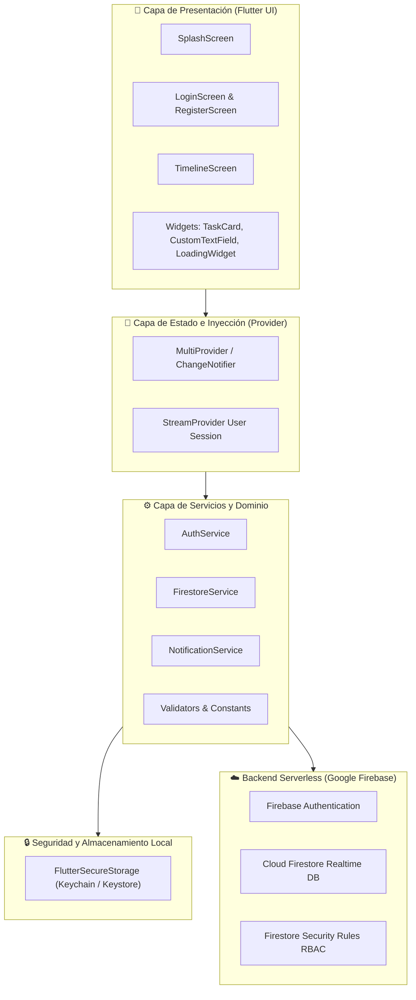

# ⏱️ EventTiming — Coordinación de Cronogramas de Eventos en Tiempo Real

> Aplicación móvil multiplataforma (Android / iOS) desarrollada en **Flutter** con backend serverless en **Firebase** y gestión de estado reactiva con **Provider**. Permite a organizadores (*planners*), proveedores y anfitriones (*novios*) gestionar, sincronizar y monitorear el cronograma minuto a minuto de cualquier evento.

---

## 📌 1. Problemática que Resuelve

La organización y ejecución de eventos de alta exigencia (bodas, galas corporativas, festivales y convenciones) enfrenta retos críticos:

- **Desconexión entre participantes:** Los cronogramas tradicionales en hojas de cálculo o documentos impresos quedan obsoletos ante el primer retraso o imprevisto.
- **Falta de visibilidad en tiempo real:** Los proveedores (catering, fotografía, iluminación, orquestas) operan a ciegas respecto al estado de las actividades previas.
- **Estrés en anfitriones y planners:** La constante necesidad de llamadas telefónicas y mensajes para confirmar si un hito inició o finalizó genera fatiga operativa y riesgo de errores de coordinación.

**EventTiming** centraliza el cronograma dinámico en una aplicación móvil intuitiva y reactiva, garantizando que cada cambio de estado se refleje inmediatamente en todos los dispositivos conectados.

---

## 🎯 2. Objetivos SMART

| Dimensión | Definición del Objetivo |
| :--- | :--- |
| **S (Específico)** | Desarrollar y desplegar una aplicación móvil multiplataforma que sincronice el timeline de eventos en tiempo real entre planners, novios y proveedores. |
| **M (Medible)** | Lograr una reducción del **40% en los tiempos de espera y desajustes de horarios** entre proveedores y una tasa de satisfacción del usuario superior al **95%** en encuestas post-evento. |
| **A (Alcanzable)** | Utilizar servicios administrados de Firebase (Authentication y Cloud Firestore) para garantizar escalabilidad automática sin requerir infraestructura de servidor dedicada. |
| **R (Relevante)** | Brindar tranquilidad y control total a planners y anfitriones, transformando la puntualidad y coordinación en la principal ventaja competitiva del evento. |
| **T (Tiempo)** | Concluir el MVP funcional en un plazo de **4 semanas** bajo ciclos iterativos de desarrollo ágil. |

---

## 🏗️ 3. Arquitectura de la Solución

La aplicación sigue una arquitectura limpia en capas (*Clean Architecture*) desacoplada, reactiva y mantenible:



---

## 🛠️ 4. Stack Tecnológico

- **Framework:** [Flutter 3.x](https://flutter.dev/) (Channel Stable)
- **Lenguaje:** [Dart 3.x](https://dart.dev/)
- **Backend & Base de Datos:**
  - **Firebase Authentication:** Autenticación por correo y contraseña, gestión de sesiones y recuperación de accesos.
  - **Cloud Firestore:** Base de datos NoSQL documental con suscripciones en tiempo real (`Streams`).
- **Gestión de Estado:** [Provider 6.x](https://pub.dev/packages/provider)
- **Seguridad en Dispositivo:** [flutter_secure_storage 9.x](https://pub.dev/packages/flutter_secure_storage) (Cifrado AES en Android Keystore y Apple Keychain en iOS)
- **Diseño & UI:** Google Material Design 3 con paleta personalizada (Azul `#1976D2`, Naranja `#FB8C00`, Verde `#43A047`).

---

## 🔐 5. Estrategia de Seguridad

1. **Almacenamiento Local Cifrado:**
   - Los tokens JWT de sesión y credenciales sensibles se guardan mediante `FlutterSecureStorage`, evitando el uso de almacenamiento plano (`SharedPreferences`).
2. **Control de Acceso Basado en Roles (RBAC):**
   - Perfiles diferenciados: `planner` (creador y administrador general), `proveedor` (ejecutor de hitos asignados) y `novio` (visualizador de timeline).
   - Reglas de Firestore estrictas (`firestore.rules`) que impiden escrituras o eliminaciones no autorizadas.
3. **Comunicaciones Cifradas:**
   - Todas las llamadas al backend se realizan mediante HTTPS / TLS 1.3 con certificados SSL de Google Cloud.
4. **Validación y Sanitización en Cliente:**
   - Validadores estrictos con expresiones regulares para correos electrónicos, contraseñas de al menos 6 caracteres y control de desbordamiento en formularios.

---

## 💰 6. Simulador de Costos (Firebase)

Estimación proyectada para un volumen inicial de **100 eventos mensuales**, con un promedio de **50 tareas por evento** y **10 usuarios concurrentes** por evento:

| Concepto / Servicio | Consumo Mensual Estimado | Plan Spark (Gratis) | Plan Blaze (Pay-as-you-go) |
| :--- | :--- | :--- | :--- |
| **Firebase Auth** | ~1,000 usuarios activos | **Gratis** (hasta 50,000 / mes) | $0.00 USD |
| **Firestore: Lecturas** | ~350,000 lecturas / mes | **Gratis** (50,000 / día = 1.5M / mes) | $0.00 USD (dentro del cupo) |
| **Firestore: Escrituras** | ~25,000 escrituras / mes | **Gratis** (20,000 / día = 600K / mes) | $0.00 USD (dentro del cupo) |
| **Firestore: Almacenamiento** | ~250 MB | **Gratis** (hasta 1 GB) | $0.00 USD |
| **Tráfico de Red Egress** | ~1.5 GB | **Gratis** (hasta 10 GB / mes) | $0.00 USD |
| **Costo Total Estimado** | — | **$0.00 USD / mes** | **~$0.00 - $2.50 USD / mes** |

> *Nota:* Para la fase de lanzamiento y escalamiento temprano, el **Plan Spark Gratuito** de Firebase cubre el 100% de la operación sin incurrir en costos de infraestructura.

---

## 📁 7. Estructura del Proyecto

```
event_timing/
├── firestore.rules               # Reglas de seguridad declarativas de Firestore
├── pubspec.yaml                  # Dependencias y configuración de assets
├── README.md                     # Documentación técnica completa
├── test/
│   └── widget_test.dart          # Pruebas unitarias de validadores y modelos
└── lib/
    ├── main.dart                 # Inicialización de Firebase, MultiProvider y rutas
    ├── models/
    │   ├── user_model.dart       # Entidad de usuario (uid, email, rol, nombre)
    │   ├── event_model.dart      # Entidad de evento (lugar, fecha, plannerId)
    │   └── task_model.dart       # Entidad de tarea (horarios, estado, responsable)
    ├── screens/
    │   ├── splash_screen.dart    # Verificación de sesión inicial y animación
    │   ├── login_screen.dart     # Formulario de acceso y recuperación de contraseña
    │   ├── register_screen.dart  # Creación de cuenta con selección de rol
    │   └── timeline_screen.dart  # Lista reactiva de tareas, FAB y modal interactivo
    ├── widgets/
    │   ├── task_card.dart        # Tarjeta de tarea con colores según estado y modal
    │   ├── loading_widget.dart   # Indicador circular de progreso unificado
    │   └── custom_text_field.dart# Campo de entrada con validación e íconos
    ├── services/
    │   ├── auth_service.dart     # Métodos de autenticación y tokens en SecureStorage
    │   ├── firestore_service.dart# Operaciones CRUD y streams de eventos/tareas
    │   └── notification_service.dart # Servicio de notificaciones y recordatorios
    └── utils/
        ├── constants.dart        # Colores, estilos tipográficos y rutas del sistema
        └── validators.dart       # Reglas de validación para formularios
```

---

## 🚀 8. Guía de Instalación y Despliegue

### Requisitos Previos
- **Flutter SDK:** versión 3.16 o superior ([Guía de instalación](https://docs.flutter.dev/get-started/install)).
- **Dart SDK:** versión 3.0 o superior.
- **Android Studio** (con SDK de Android 13+) o **Xcode** (para compilación en iOS / macOS).
- **Node.js & Firebase CLI:** `npm install -g firebase-tools`.

### Pasos de Instalación

1. **Navegar a la carpeta del proyecto:**
   ```bash
   cd event_timing
   ```

2. **Instalar dependencias de Flutter:**
   ```bash
   flutter pub get
   ```

3. **Ejecutar pruebas unitarias y análisis estático:**
   ```bash
   flutter test
   flutter analyze
   ```

4. **Configuración de Firebase:**
   - Inicia sesión con la CLI de Firebase:
     ```bash
     firebase login
     ```
   - Configura el proyecto con FlutterFire CLI:
     ```bash
     dart pub global activate flutterfire_cli
     flutterfire configure
     ```
   - Alternativamente, coloca tus archivos descargados de la consola de Firebase:
     - Android: `android/app/google-services.json`
     - iOS: `ios/Runner/GoogleService-Info.plist`

5. **Desplegar reglas de Firestore:**
   ```bash
   firebase deploy --only firestore:rules
   ```

6. **Ejecutar la aplicación en emulador o dispositivo físico:**
   ```bash
   flutter run
   ```

---

## 💡 9. Metodología de Desarrollo

El proyecto fue desarrollado integrando **Design Thinking** para la definición de la experiencia de usuario y **Metodologías Ágiles (Scrum/Kanban)** para la entrega continua:

```
[ Empatizar ] ➔ [ Definir ] ➔ [ Idear ] ➔ [ Prototipar ] ➔ [ Testear ]
      │                                                         │
      └────────────────── Iteraciones Ágiles ───────────────────┘
```

- **Empatizar:** Entrevistas a wedding planners profesionales para identificar los momentos de mayor fricción durante el evento.
- **Definir:** Mapeo del Customer Journey y definición del "Timeline Dinámico" como funcionalidad medular.
- **Idear:** Sesiones de diseño de interfaz priorizando la legibilidad rápida a distancia mediante códigos de color (Naranja = Pendiente, Azul = En Curso, Verde = Completado).
- **Prototipar:** Desarrollo modular en Flutter con componentes desacoplados reutilizables.
- **Testear:** Pruebas unitarias automatizadas (`flutter test`) y validación continua de estados.

---

## 👥 10. Equipo de Proyecto

- **Lead Mobile Developer & Cloud Architect:** Implementación de Flutter, Provider y servicios en la nube con Firebase.
- **UI/UX Designer:** Diseño de experiencia, paleta cromática de accesibilidad y microinteracciones.
- **QA & Security Engineer:** Pruebas automatizadas, auditoría de reglas Firestore y validación de almacenamiento seguro.

---

## 📄 11. Licencia

Este proyecto está bajo la Licencia **MIT**. Consulta el archivo [LICENSE](LICENSE) para más detalles.
