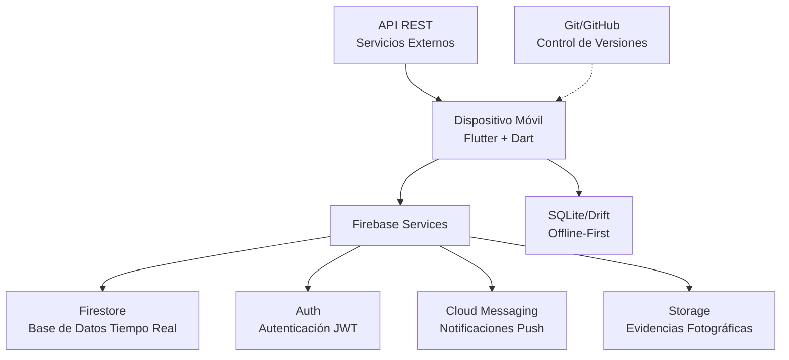

# ⏱️ EventTiming

**Aplicación Móvil Multiplataforma en Flutter con Integración Firebase para la Gestión del Timing en Tiempo Real en Eventos Sociales**

[](https://flutter.dev)
[](https://dart.dev)
[](https://firebase.google.com)
[](https://opensource.org/licenses/MIT)
[](https://github.com/MAXTONYENZO/EventTiming-App)

---

## 📋 Tabla de Contenidos

1. [Descripción del Proyecto](#-1-descripción-del-proyecto)
2. [Problemática](#-2-problemática)
3. [Pregunta Problema](#-3-pregunta-problema)
4. [Objetivos SMART](#-4-objetivos-smart)
5. [Arquitectura de la Solución](#-5-arquitectura-de-la-solución)
6. [Stack Tecnológico](#-6-stack-tecnológico)
7. [Estrategia de Seguridad](#-7-estrategia-de-seguridad)
8. [Simulador de Costos](#-8-simulador-de-costos)
9. [Estructura del Proyecto](#-9-estructura-del-proyecto)
10. [Guía de Instalación y Despliegue](#-10-guía-de-instalación-y-despliegue)
11. [Metodología de Desarrollo](#-11-metodología-de-desarrollo)
12. [Equipo](#-12-equipo)
13. [Licencia](#-13-licencia)

---

## 📱 1. Descripción del Proyecto

**EventTiming** es una aplicación móvil multiplataforma desarrollada en **Flutter** con integración **Firebase** que permite la gestión colaborativa del cronograma en tiempo real para eventos sociales (bodas, celebraciones y eventos corporativos).

La app sincroniza a **wedding planners, proveedores y novios** en un solo ecosistema, reduciendo los tiempos de coordinación y mejorando la comunicación durante todo el ciclo del evento, desde la planificación hasta la ejecución y desmontaje.

### 🎯 ¿Por qué EventTiming?

| Dimensión | Descripción |
|-----------|-------------|
| **📱 Multiplataforma** | Una sola base de código para Android e iOS gracias a Flutter. |
| **⚡ Tiempo Real** | Sincronización instantánea con Firebase Firestore. |
| **🔐 Seguro** | Autenticación con Firebase Auth y almacenamiento cifrado con `flutter_secure_storage`. |
| **📡 Offline-First** | Arquitectura que permite trabajar sin conexión y sincroniza al recuperar red. |
| **👥 Colaborativo** | Gestión de roles diferenciados (planner, proveedores, novios). |
| **💰 Costo Cero** | El plan gratuito de Firebase (Spark) cubre el 100% de la operación para proyectos en etapa inicial. |

---

## 🎯 2. Problemática

Los organizadores de eventos y proveedores enfrentan una coordinación ineficiente debido a la falta de una herramienta móvil centralizada. Actualmente, la comunicación depende de **canales fragmentados** como WhatsApp, llamadas telefónicas y listas en papel, generando tres problemáticas críticas:

| # | Problemática | Impacto |
|---|--------------|---------|
| 1 | **Falta de visibilidad en tiempo real** del estado de las tareas | Incremento de la carga operativa en un **40%** durante las horas previas al evento. |
| 2 | **Retrasos no comunicados oportunamente** | Desfases de hasta **30 minutos** en el cronograma, afectando la experiencia de los asistentes. |
| 3 | **Procesos manuales desactualizados** | Más de **2 horas diarias** dedicadas a actualizar y comunicar cambios, reduciendo el tiempo para tareas estratégicas. |

### 📊 Datos Relevantes

| Indicador | Valor |
|-----------|-------|
| **Carga operativa extra** | +40% en horas previas al evento |
| **Retraso promedio** | 30 minutos por evento |
| **Tiempo en actualizaciones** | 2 horas diarias |
| **Reducción esperada** | 50% de los tiempos de coordinación |

---

## ❓ 3. Pregunta Problema

> ¿De qué manera la implementación de una aplicación móvil multiplataforma en **Flutter** con integración **Firebase** y sincronización en **tiempo real** permite reducir en un **50% los tiempos de coordinación** entre wedding planners y proveedores durante la organización y ejecución de eventos sociales?

---

## 🎯 4. Objetivos SMART

### Objetivo General

> Desarrollar una aplicación móvil multiplataforma en Flutter con integración Firebase que permita la gestión del timing en tiempo real en eventos sociales, logrando una **reducción del 50% en los tiempos de coordinación** entre wedding planners y proveedores, y alcanzando una **calificación de usabilidad superior a 80 puntos en la escala SUS**, en un período de **8 semanas** con enfoque en dispositivo Android.

### Desglose SMART

| Criterio | Descripción |
|----------|-------------|
| **S** (Específico) | Desarrollar y desplegar una aplicación móvil multiplataforma que sincronice el timeline de eventos en tiempo real entre planners, novios y proveedores. |
| **M** (Medible) | Reducción del **50%** en tiempos de coordinación y calificación de usabilidad **SUS > 80**. |
| **A** (Alcanzable) | Utilizar servicios administrados de Firebase (Authentication y Cloud Firestore) para garantizar escalabilidad automática sin requerir infraestructura de servidor dedicada. |
| **R** (Relevante) | Brindar tranquilidad y control total a planners y anfitriones, transformando la puntualidad y coordinación en la principal ventaja competitiva del evento. |
| **T** (Time-bound) | Concluir el MVP funcional en un período de **8 semanas** bajo ciclos iterativos de desarrollo ágil. |

### Objetivos Específicos (3 Fases)

| Fase | Objetivo | Plazo | Criterio de Éxito |
|------|----------|-------|-------------------|
| **1** | **Investigación de Usuario y Prototipado UX/UI** | Semana 2 | Diseñar wireframes y prototipo en Figma, evaluando con 5 usuarios y alcanzando SUS > 85. |
| **2** | **Desarrollo Frontend e Integración API/Backend** | Semana 6 | Programar módulos en Flutter, integrar Firebase con tiempo de respuesta < 500 ms. |
| **3** | **Pruebas en Dispositivos Reales y Medición** | Semana 8 | Probar en 10 dispositivos Android, con batería <5%/hora y SUS > 80. |

---

## 🏗️ 5. Arquitectura de la Solución

La aplicación sigue una **arquitectura limpia en capas (Clean Architecture)** desacoplada, reactiva y mantenible, implementando el patrón **Offline-First**.

### Diagrama de Arquitectura

La aplicación sigue una arquitectura limpia en capas (*Clean Architecture*) desacoplada, reactiva y mantenible:


## Diseño en Capas

| Capa | Tecnología | Descripción |
|------|------------|-------------|
| **Presentación (UI)** | Flutter + Dart | Widgets, pantallas, gestión de estado con Provider. |
| **Dominio (Lógica de Negocio)** | Dart | Modelos de datos, validadores, casos de uso. |
| **Datos (Persistencia)** | Firebase Firestore + SQLite | Sincronización en tiempo real y almacenamiento local Offline-First. |
| **Servicios Externos** | Firebase Auth, FCM, Storage | Autenticación, notificaciones push y almacenamiento de archivos. |

---

## 🛠️ Stack Tecnológico

| Capa | Tecnología | Versión | Propósito |
|------|------------|---------|-----------|
| **Framework** | Flutter | 3.x | Desarrollo multiplataforma (Android/iOS). |
| **Lenguaje** | Dart | 3.x | Lenguaje nativo de Flutter. |
| **Backend & Base de Datos** | Firebase Firestore | - | Base de datos NoSQL con suscripciones en tiempo real (Streams). |
| **Autenticación** | Firebase Auth | - | Autenticación por correo/contraseña, gestión de sesiones y recuperación de accesos. |
| **Notificaciones** | Firebase Cloud Messaging | - | Push notifications para cambios de timing y alertas de retraso. |
| **Almacenamiento** | Firebase Storage | - | Evidencias fotográficas de tareas completadas. |
| **Gestión de Estado** | Provider | 6.x | Gestión de estado reactiva y escalable. |
| **Seguridad en Dispositivo** | `flutter_secure_storage` | 9.x | Cifrado AES en Android Keystore y Apple Keychain. |
| **Persistencia Local** | SQLite / Drift | - | Offline-First: almacenamiento local para funcionar sin conexión. |
| **Control de Versiones** | Git / GitHub | - | Repositorio público para revisión académica y colaboración. |

---

## 🔐 Estrategia de Seguridad

### Almacenamiento Local Cifrado

Los tokens JWT de sesión y credenciales sensibles se guardan mediante **`flutter_secure_storage`** (EncryptedSharedPreferences en Android y Apple Keychain en iOS), evitando el uso de almacenamiento plano (SharedPreferences).

### Control de Acceso Basado en Roles (RBAC)

| Rol | Permisos |
|-----|----------|
| **Planner** | Creación y administración general del evento. |
| **Proveedor** | Ejecución de hitos asignados y actualización de estado. |
| **Novio** | Visualización del timeline en tiempo real. |

Las reglas de Firestore (`firestore.rules`) impiden escrituras o eliminaciones no autorizadas.

### Comunicaciones Cifradas

Todas las llamadas al backend se realizan mediante **HTTPS / TLS 1.3** con certificados SSL de Google Cloud, garantizando la confidencialidad de los datos transmitidos.

### Validación y Sanitización en Cliente

Validadores estrictos con expresiones regulares para:
- Correos electrónicos.
- Contraseñas de al menos 6 caracteres.
- Control de desbordamiento en formularios.

### Resumen de Seguridad

| Pilar | Tecnología | Descripción |
|-------|------------|-------------|
| **Almacenamiento Cifrado** | `flutter_secure_storage` | Cifra tokens y credenciales en el dispositivo. |
| **Comunicación Segura** | HTTPS / TLS 1.3 | Todas las peticiones viajan cifradas. |
| **Autenticación** | Firebase Auth + JWT | Tokens renovables validados en cada petición. |
| **Control de Acceso** | Firebase Security Rules | Control granular por roles (planner, proveedores, novios). |

---

## 💰 Simulador de Costos

**Estimación proyectada** para un volumen inicial de **100 eventos mensuales**, con un promedio de **50 tareas por evento** y **10 usuarios concurrentes por evento**.

| Concepto / Servicio | Consumo Mensual Estimado | Plan Spark (Gratis) | Plan Blaze (Pay-as-you-go) |
|---------------------|--------------------------|---------------------|----------------------------|
| **Firebase Auth** | ~1,000 usuarios activos | Gratis (hasta 50,000 / mes) | $0.00 USD |
| **Firestore: Lecturas** | ~350,000 lecturas / mes | Gratis (50,000 / día = 1.5M / mes) | $0.00 USD |
| **Firestore: Escrituras** | ~25,000 escrituras / mes | Gratis (20,000 / día = 600K / mes) | $0.00 USD |
| **Firestore: Almacenamiento** | ~250 MB | Gratis (hasta 1 GB) | $0.00 USD |
| **Tráfico de Red Egress** | ~1.5 GB | Gratis (hasta 10 GB / mes) | $0.00 USD |
| **Costo Total Estimado** | — | **$0.00 USD / mes** | **~$0.00 - $2.50 USD / mes** |

### 📊 Resumen de Costos

| Concepto | Proveedor | Frecuencia | Costo USD |
|----------|-----------|------------|-----------|
| Google Play Console | Google | Pago Único | $25.00 |
| Apple Developer Program | Apple | Suscripción Anual | $99.00 |
| Firebase (Blaze Plan) | Google Cloud | Estimado Mensual | $15.00 |
| Firebase Cloud Storage | Google Cloud | Estimado Mensual | $5.00 |
| **Costo Total Estimado** | | | **$144.00 USD** |

**Presupuesto Asignado:** $300.00 USD  
**Eficiencia de Presupuesto:** 52% libre

**Nota:** Para la fase de lanzamiento y escalamiento temprano, el **Plan Spark Gratuito** de Firebase cubre el 100% de la operación sin incurrir en costos de infraestructura.

---

## 📁 9. Estructura del Proyecto

```
event_timing/
├── firestore.rules               # Reglas de seguridad declarativas de Firestore
├── pubspec.yaml                  # Dependencias y configuración de assets
├── README.md                     # Documentación técnica completa
├── test/
│   └── widget_test.dart          # Pruebas unitarias de validadores y modelos
└── lib/
    ├── main.dart                 # Inicialización de Firebase, MultiProvider y rutas
    ├── models/
    │   ├── user_model.dart       # Entidad de usuario (uid, email, rol, nombre)
    │   ├── event_model.dart      # Entidad de evento (lugar, fecha, plannerId)
    │   └── task_model.dart       # Entidad de tarea (horarios, estado, responsable)
    ├── screens/
    │   ├── splash_screen.dart    # Verificación de sesión inicial y animación
    │   ├── login_screen.dart     # Formulario de acceso y recuperación de contraseña
    │   ├── register_screen.dart  # Creación de cuenta con selección de rol
    │   └── timeline_screen.dart  # Lista reactiva de tareas, FAB y modal interactivo
    ├── widgets/
    │   ├── task_card.dart        # Tarjeta de tarea con colores según estado y modal
    │   ├── loading_widget.dart   # Indicador circular de progreso unificado
    │   └── custom_text_field.dart# Campo de entrada con validación e íconos
    ├── services/
    │   ├── auth_service.dart     # Métodos de autenticación y tokens en SecureStorage
    │   ├── firestore_service.dart# Operaciones CRUD y streams de eventos/tareas
    │   └── notification_service.dart # Servicio de notificaciones y recordatorios
    └── utils/
        ├── constants.dart        # Colores, estilos tipográficos y rutas del sistema
        └── validators.dart       # Reglas de validación para formularios
```

---

## 🚀 10. Guía de Instalación y Despliegue

### Requisitos Previos
- **Flutter SDK:** versión 3.16 o superior ([Guía de instalación](https://docs.flutter.dev/get-started/install)).
- **Dart SDK:** versión 3.0 o superior.
- **Android Studio** (con SDK de Android 13+) o **Xcode** (para compilación en iOS / macOS).
- **Node.js & Firebase CLI:** `npm install -g firebase-tools`.

### Pasos de Instalación

1. **Navegar a la carpeta del proyecto:**
   ```bash
   cd event_timing
   ```

2. **Instalar dependencias de Flutter:**
   ```bash
   flutter pub get
   ```

3. **Ejecutar pruebas unitarias y análisis estático:**
   ```bash
   flutter test
   flutter analyze
   ```

4. **Configuración de Firebase:**
   - Inicia sesión con la CLI de Firebase:
     ```bash
     firebase login
     ```
   - Configura el proyecto con FlutterFire CLI:
     ```bash
     dart pub global activate flutterfire_cli
     flutterfire configure
     ```
   - Alternativamente, coloca tus archivos descargados de la consola de Firebase:
     - Android: `android/app/google-services.json`
     - iOS: `ios/Runner/GoogleService-Info.plist`

5. **Desplegar reglas de Firestore:**
   ```bash
   firebase deploy --only firestore:rules
   ```

6. **Ejecutar la aplicación en emulador o dispositivo físico:**
   ```bash
   flutter run
   ```

---

## 💡 11. Metodología de Desarrollo

El proyecto fue desarrollado integrando **Design Thinking** para la definición de la experiencia de usuario y **Metodologías Ágiles (Scrum/Kanban)** para la entrega continua:

```
[ Empatizar ] ➔ [ Definir ] ➔ [ Idear ] ➔ [ Prototipar ] ➔ [ Testear ]
      │                                                         │
      └────────────────── Iteraciones Ágiles ───────────────────┘
```

- **Empatizar:** Entrevistas a wedding planners profesionales para identificar los momentos de mayor fricción durante el evento.
- **Definir:** Mapeo del Customer Journey y definición del "Timeline Dinámico" como funcionalidad medular.
- **Idear:** Sesiones de diseño de interfaz priorizando la legibilidad rápida a distancia mediante códigos de color (Naranja = Pendiente, Azul = En Curso, Verde = Completado).
- **Prototipar:** Desarrollo modular en Flutter con componentes desacoplados reutilizables.
- **Testear:** Pruebas unitarias automatizadas (`flutter test`) y validación continua de estados.

---

## 👥 10. Equipo de Proyecto

- **Lead Mobile Developer & Cloud Architect:** Implementación de Flutter, Provider y servicios en la nube con Firebase.
- **UI/UX Designer:** Diseño de experiencia, paleta cromática de accesibilidad y microinteracciones.
- **QA & Security Engineer:** Pruebas automatizadas, auditoría de reglas Firestore y validación de almacenamiento seguro.

---

## 📄 11. Licencia

Este proyecto está bajo la Licencia **MIT**. Consulta el archivo [LICENSE](LICENSE) para más detalles.
=======


